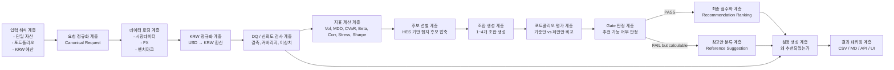

# HedgeMate 엔진 내부 구조도

## 1. 엔진 목적
HedgeMate 엔진은 사용자가 입력한 **단일 자산** 또는 **포트폴리오**를 기준으로,  
KRW 기준 리스크를 분석하고 **손실 완화 중심의 헷지 조합**을 추천하는 분석 엔진이다.

핵심 원칙은 다음과 같다.

- **KRW 기준 일관성**
- **리스크 완화 우선**
- **설명 가능한 추천**
- **추천안 / 참고안 분리**
- **데이터 부족 시에도 계산은 허용하되 신뢰도는 별도 관리**

---

## 2. 엔진 전체 흐름

---

## 3. 계층별 역할

## 3.1 입력 해석 계층
사용자 입력을 엔진이 이해할 수 있는 요청 형태로 바꾼다.

### 입력 종류
- 단일 자산 입력
- 포트폴리오 입력
- 헷지 예산 입력(KRW 우선)

### 역할
- 회사명 / 자산명 / 티커를 정규화
- 포트폴리오를 표준 비중 구조로 변환
- 예산을 KRW 기준으로 통일

---

## 3.2 요청 정규화 계층
모든 입력을 하나의 공통 요청 객체로 변환한다.

### 예시 구조
- `mode`: single_asset | portfolio
- `base_assets`
- `base_weights`
- `budget_krw`
- `max_combo_size`
- `candidate_mode`

이 계층이 있으면 이후 분석 엔진은  
입력 종류와 무관하게 같은 방식으로 처리할 수 있다.

---

## 3.3 데이터 로딩 계층
분석에 필요한 원천 데이터를 모은다.

### 입력 데이터
- 가격/거래량 데이터
- FX 데이터
- 벤치마크 데이터

### 역할
- raw 데이터 로드
- 캐시 재사용
- 벤치마크 fallback 처리
- 실행 시점 기준 데이터 버전 결정

---

## 3.4 KRW 정규화 계층
모든 자산을 KRW 기준 시계열로 맞춘다.

### 역할
- USD 자산: `price_usd × usdkrw`
- KRW 자산: 그대로 사용
- 이후 수익률/리스크 계산은 모두 KRW 기준으로 수행

### 의미
이 계층이 HedgeMate 엔진의 기준 통화를 고정하는 핵심이다.

---

## 3.5 DQ / 신뢰도 검사 계층
데이터의 사용 가능성과 신뢰도를 점검한다.

### 확인 항목
- 결측치
- 캘린더 커버리지
- 가격 무결성
- 이상치
- FX 미매칭

### 역할
- 완전 제외할 데이터와
- 계산은 가능하지만 경고가 필요한 데이터를 구분

---

## 3.6 지표 계산 계층
자산 단위와 포트폴리오 단위의 핵심 리스크 지표를 계산한다.

### 핵심 지표
- 변동성
- MDD
- VaR / CVaR
- Beta / Downside Beta
- Corr
- Stress 구간 평균 수익률
- Sharpe proxy

### 역할
후보 선별과 조합 평가의 공통 기반이 된다.

---

## 3.7 후보 선별 계층
전체 유니버스에서 헷지 후보군을 압축한다.

### 방식
- DQ FAIL 제외
- 후보 자산군 필터링
- HES 기반 예비 점수 계산
- 상위 후보군만 조합 탐색 대상으로 사용

### 목적
전체 탐색 비용을 줄이면서도 의미 있는 후보를 유지한다.

---

## 3.8 조합 생성 계층
선별된 후보들로 실제 헷지 조합을 만든다.

### 범위
- 1개 조합
- 2개 조합
- 3개 조합
- 4개 조합

### 역할
- 다양성 규칙 적용
- 자기 자신 중복 방지
- 조합별 예산 분배 구조 생성

---

## 3.9 포트폴리오 평가 계층
기준 포트폴리오와 제안 포트폴리오를 직접 비교한다.

### 비교 대상
- 기준안
- 1:1 제안안
- 다자산 제안안

### 비교 결과
- CVaR 개선
- MDD 개선
- Stress 개선
- Corr/Beta 개선
- Sharpe 변화

---

## 3.10 Gate 판정 계층
이 조합을 **정식 추천안**으로 볼 수 있는지 판정한다.

### 판정 결과
- **PASS** → 추천안
- **FAIL but calculable** → 참고안

### 의미
이 계층이 “추천”과 “참고”를 나누는 핵심 경계다.

---

## 3.11 최종 점수화 계층
Gate를 통과한 후보들을 점수화해 순위를 정한다.

### 역할
- 추천안 간 우선순위 결정
- 최적 1개 선택
- Top N 후보 정렬

### 특징
수익 최대화보다 **방어력 우선 점수화** 철학을 따른다.

---

## 3.12 설명 생성 계층
추천 결과를 사람이 이해할 수 있게 번역한다.

### 출력 예시
- 왜 이 자산/조합이 추천되었는가
- 어떤 리스크가 얼마나 줄었는가
- 데이터 신뢰도는 어떤 수준인가
- 추천안인지 참고안인지

이 계층이 없으면 엔진은 숫자 계산기에 머무르고,  
있으면 “의사결정 보조 도구”가 된다.

---

## 3.13 결과 패키징 계층
분석 결과를 실제 사용 가능한 형태로 내보낸다.

### 출력 대상
- CSV
- 실행 결과 MD
- API 응답
- 웹 UI 표시 데이터

### 역할
동일한 분석 결과를 여러 소비 채널에서 재사용할 수 있게 만든다.

---

## 4. 엔진 내부 핵심 객체

### 4.1 Canonical Request
사용자 입력을 정규화한 분석 요청 객체

### 4.2 Market Bundle
시장데이터 + FX + 벤치마크를 묶은 데이터 객체

### 4.3 Feature Set
자산별 핵심 지표 묶음

### 4.4 Candidate Pool
헷지 후보 압축 결과

### 4.5 Evaluation Result
기준안 대비 제안안 비교 결과

### 4.6 Recommendation Package
추천안 / 참고안 / 설명 / 신뢰도까지 포함한 최종 결과

---

## 5. 엔진 설계 철학 요약

HedgeMate 엔진은 단순한 추천기가 아니라,  
다음 구조를 가진 **방어형 의사결정 엔진**이다.

> 입력을 쉽게 받고  
> KRW 기준으로 정규화하고  
> 리스크를 계산하고  
> 후보를 압축하고  
> 조합을 평가한 뒤  
> 추천안과 참고안을 나눠  
> 이유까지 설명해서 돌려주는 구조

---

## 6. 한 줄 구조 요약
> **입력 정규화 → 데이터 로딩 → KRW 변환 → DQ 검사 → 지표 계산 → 후보 선별 → 조합 생성 → 포트폴리오 평가 → Gate 판정 → 점수화 → 설명 생성 → 결과 출력**
