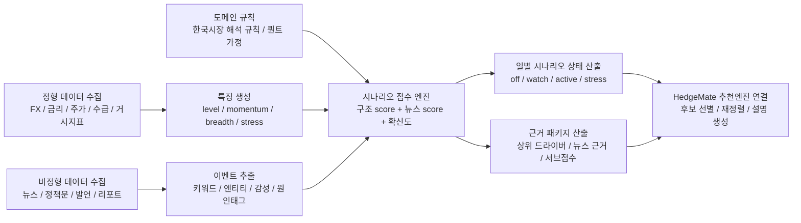

# HedgeMate 대표 시나리오 파일럿 연구계획 (2026-04-15)

## 1. 문서 목적
본 문서는 HedgeMate의 "시장 상태 / 시나리오 분석 엔진"을 본격적으로 설계하기 전에,
가장 먼저 구현할 **대표 시나리오 1개**를 선정하고
그 시나리오를 기준으로 앞으로의 데이터 수집, 시계열 분석, 비정형 데이터 수집, 결과 병합, 검증 체계를
어떻게 설계할지 정리한 실행용 기획 문서이다.

현재 HedgeMate는 KRW 기준 리스크 계산과 방어형 추천 파이프라인을 이미 갖고 있으나,
시장 상태를 동적으로 해석하는 계층은 아직 없다.

- 문제 정의 근거: `HedgeMate/docs/0401_핵심문제.md`
- 현재 엔진 흐름 근거: `HedgeMate/엔진내부구조.md`
- 현재 파이프라인 접점 근거: `HedgeMate/scripts/run_data_pipeline.py:2151`, `HedgeMate/scripts/run_data_pipeline.py:2356`, `HedgeMate/scripts/run_data_pipeline.py:2381`

이 문서의 목표는
단순히 "어떤 시나리오를 넣자"가 아니라,
**하나의 대표 시나리오를 파일럿으로 삼아 V1 7개 시나리오, 최대 10개 시나리오까지 확장 가능한 공통 연구 프레임워크를 만드는 것**이다.

---

## 2. 대표 시나리오 선정

## 2.1 선정 시나리오
**대표 시나리오 파일럿: `달러 강세 / 원화 약세`**

## 2.2 이 시나리오를 먼저 선택하는 이유
이 시나리오는 HedgeMate의 첫 번째 파일럿으로 가장 적합하다.

1. **프로젝트 정체성과 직접 연결된다.**
HedgeMate는 KRW 기준 엔진이다. 따라서 원화 약세는 거의 모든 해외자산, 헷지 성과, 환산 수익률 해석에 직접 영향을 준다.

2. **정형 데이터 품질이 높다.**
USD/KRW, DXY, 미국 금리, 한국 금리, KOSPI, 외국인 수급, 수출 관련 지표는 비교적 일관된 시계열로 확보 가능하다.

3. **다른 시나리오와 연결되는 중심 축이다.**
지정학 충격, 글로벌 리스크오프, 재인플레이션, 중국 둔화, 무역분절은 한국 시장에서는 종종 원화 약세로 전이된다.
즉, 이 시나리오는 다른 리스크 시나리오의 "한국형 전달 채널" 역할을 한다.

4. **비정형 데이터 결합이 가능하다.**
환율 자체만 보면 단순 FX 신호에 그치지만,
뉴스/정책/발언 데이터를 결합하면
"왜 지금 원화가 약한가"를 설명할 수 있다.

5. **확장성이 좋다.**
이 시나리오를 성공적으로 구현하면,
동일한 파이프라인을 활용해 `지정학 충격`, `금리 급등`, `중국 둔화`, `에너지 급등`으로 확장할 수 있다.

## 2.3 전체 시나리오 체계
시나리오는 한 레벨에서 모두 나열하지 않고 아래처럼 관리한다.

1. `일별 분류 시나리오`
현재 시장 상태를 매일 분류하는 메인 시나리오 집합이다.

2. `역사적 검증 케이스`
과거 위기 구간을 시나리오 분류의 타당성 검증에 사용하는 별도 케이스 라이브러리다.

3. `가정형 스트레스 템플릿`
Base, 금리 급등, 원화 약세, 유가 급등 같은 what-if 충격 실험용 템플릿이다.

즉, `GFC`, `COVID`, `러-우 전쟁`은 일별 시나리오 목록에 직접 넣지 않고,
별도 검증 케이스로 관리한다.

## 2.4 V1 구현 대상 시나리오
V1에서는 아래 7개만 구현한다.

| 구분 | 시나리오 | 비고 |
| --- | --- | --- |
| 1 | `Soft Landing / Goldilocks` | 정상 우호 장세, Base에 대응 |
| 2 | `Slowdown / Recession / Deflation Risk` | 성장둔화, 디플레이션 위험 포함 |
| 3 | `Higher-for-Longer / Long-Rate Shock` | 금리 급등, 재정 프리미엄 확대 포함 |
| 4 | `Stagflation / Reinflation / Energy Shock` | 재인플레이션, 유가·원자재 급등 포함 |
| 5 | `USD Strength / KRW Weakness` | 한국형 외환 스트레스 축 |
| 6 | `Acute Global Stress / Liquidity Crunch` | 급성 리스크오프, 유동성 경색 |
| 7 | `China / Trade Fragmentation Shock` | 중국 둔화, 관세·공급망 충격 포함 |

위 7개면 현재 현업에서 흔히 쓰는 큰 거시 레짐과,
한국 투자자 관점에서 중요한 시장 표현을 같이 커버할 수 있다.

## 2.5 V2 +A 확장 시나리오
V1이 안정화되면 아래 시나리오를 순차적으로 추가한다.

| 구분 | 시나리오 | 추가 이유 |
| --- | --- | --- |
| V2-1 | `Korea Domestic Financial Imbalance` | 국내 주택·가계부채·금융불균형 스트레스 |
| V2-2 | `Semiconductor / AI Cycle Shock` | 한국 시장에서 반도체 비중이 높아 별도 축 필요 |
| +A | `Geopolitical Escalation` | V1에서는 원인 태그로 관리하고, 필요 시 독립 승격 |

따라서 전체 구조는 아래와 같다.

- `V1`: 7개
- `V2`: 9개
- `최대`: 10개

## 2.6 역사적 검증 케이스 분리 원칙
역사적 검증 케이스는 시나리오 정의와 분리해 별도 문서로 관리한다.

- 관리 문서: `scenario_research/validation/01_historical_validation_cases_20260415.md`
- 역할: 분류 엔진의 타당성 검증
- 비포함 원칙: 일별 시나리오 taxonomy에는 직접 포함하지 않음

---

## 3. 파일럿 시나리오 정의

## 3.1 개념 정의
본 파일럿의 대상은 단순히 "USD/KRW가 오늘 올랐다"가 아니다.

우리가 정의하려는 시나리오는 아래와 같다.

> **달러 강세 / 원화 약세 시나리오**란  
> 달러가 글로벌 기준으로 강해지고,
> 원화가 대외 리스크 또는 국내 취약성 때문에 상대적으로 더 약해지며,
> 그 결과 KRW 기준 투자자에게 환율 리스크가 의미 있게 확대된 상태를 뜻한다.

## 3.2 판별 대상
이 시나리오는 아래 4개 축을 동시에 본다.

1. **수준(Level)**: USD/KRW가 절대적으로 높은가
2. **변화율(Momentum)**: 최근 5일, 20일 기준으로 빠르게 악화되는가
3. **폭(Breadth)**: DXY, 미 금리, 한국 자산 약세, 외국인 수급 등 주변 지표가 같은 방향인가
4. **서사 확인(Narrative Confirmation)**: 뉴스와 정책 발언이 환율 스트레스를 뒷받침하는가

즉, 이 파일럿은 단일 가격 신호가 아니라
**시장구조 + 매크로 + 뉴스서사**를 동시에 반영한 composite regime 모델이다.

---

## 4. 연구 질문과 가설

## 4.1 핵심 연구 질문
1. 한국 투자자 관점에서 "달러 강세 / 원화 약세" 상태를 일별로 안정적으로 판별할 수 있는가
2. 이 상태는 단순 환율 상승일보다 더 설명력 있는 투자 시나리오로 정의될 수 있는가
3. 해당 시나리오 점수는 실제 방어 자산 선별과 추천 품질 개선에 기여하는가

## 4.2 연구 가설
### 가설 A
USD/KRW 단일 시계열보다
복수 구조 신호를 결합한 composite score가
시장 상태를 더 안정적으로 설명한다.

### 가설 B
구조화된 뉴스/정책 신호를 결합하면
단순 시장 데이터 기반 score 대비
급변 이벤트 시점의 탐지 품질이 개선된다.

### 가설 C
이 시나리오 점수를 HedgeMate 후보 선별 또는 최종 재정렬에 반영하면
기존 safe haven 반복 추천보다
더 "지금 장세에 맞는" 설명 가능한 결과가 나온다.

---

## 5. 전체 연구 구조

---

## 6. 데이터 수집 전략

## 6.1 수집 원칙
1. **먼저 무료/안정/반복 가능한 데이터로 MVP를 만든다.**
2. **정형 데이터와 비정형 데이터를 분리 수집하고, 마지막에 score 단계에서 병합한다.**
3. **크롤링은 출처 안정성과 운영 지속성을 우선한다.**
4. **뉴스 원문 전체보다 먼저 headline + timestamp + source + tags 구조를 표준화한다.**
5. **시나리오 파일럿 단계에서는 "좋은 대리지표 10개"가 "수백 개의 잡신호"보다 낫다.**

## 6.2 정형 데이터 레이어
### A. 필수 시계열
- `USD/KRW`
- `DXY`
- `US 2Y`, `US 10Y`
- `KR 3Y`, `KR 10Y`
- `KOSPI`, `KOSDAQ`, `KOSPI200`
- `SPY`
- `JP Morgan Asia Dollar Index` 또는 대체 가능한 아시아 통화 바스켓
- 외국인 코스피 순매수/순매도
- 한국 CDS 또는 대체 리스크 프록시

### B. 보조 시계열
- `USD/CNH`
- `JPY`, `TWD` 등 아시아 통화 상대 비교
- 반도체 지수(`SOXX`, 국내 반도체 대표주 바스켓)
- Brent/WTI
- 구리, 금
- 한국 수출 / 수입 / 무역수지 월별 데이터

### C. 정책/거시 정형 데이터
- 한국 기준금리
- 미국 기준금리
- 한미 금리차
- CPI / PPI
- PMI
- 수출 증가율

## 6.3 비정형 데이터 레이어
### A. 뉴스
- Reuters
- 연합인포맥스 / 연합뉴스 계열 대체 가능 출처
- 한국은행, 기재부, 금융위 보도자료
- Fed, Treasury, IMF, BIS, OECD 주요 발표문

### B. 텍스트 단위
- headline
- subheadline
- 발표문 제목
- 요약문 첫 문단
- 발언문 핵심 문장

### C. 추출 대상 엔티티
- 통화: USD, KRW, CNH, JPY
- 정책기관: Fed, BOK, MOEF
- 리스크 원인: tariffs, war, geopolitics, outflow, inflation, recession
- 국내 취약성: household debt, property, exports, semiconductors

## 6.4 수집 주기
- 시장 데이터: 일별 EOD
- 뉴스: 1시간 또는 3시간 배치
- 정책문/보도자료: 일별 체크
- 거시지표: 발표일 반영

## 6.5 저장 레이어 제안
현재 `HedgeMate/scripts/run_data_pipeline.py`는 raw / processed / reports 구조를 사용하므로,
시나리오 파일럿도 동일한 패턴을 따른다.

### 신규 raw 산출물
- `HedgeMate/outputs/raw/raw_macro_daily_{run_id}.csv`
- `HedgeMate/outputs/raw/raw_news_headlines_{run_id}.csv`
- `HedgeMate/outputs/raw/raw_policy_texts_{run_id}.csv`

### 신규 processed 산출물
- `HedgeMate/outputs/processed/scenario_feature_daily_{run_id}.csv`
- `HedgeMate/outputs/processed/scenario_news_signal_{run_id}.csv`
- `HedgeMate/outputs/processed/scenario_state_daily_{run_id}.csv`
- `HedgeMate/outputs/processed/asset_scenario_exposure_{run_id}.csv`

### 신규 report 산출물
- `HedgeMate/outputs/reports/scenario_research_report_{run_id}.md`
- `HedgeMate/outputs/reports/scenario_validation_{run_id}.csv`

---

## 7. 시계열 분석 설계

## 7.1 특징(feature) 설계 원칙
각 시계열은 단순 원값보다 아래 형태로 변환한다.

1. level
2. 5일/20일/60일 변화율
3. rolling z-score
4. rolling percentile
5. 변화 가속도
6. cross-asset spread

예:
- `usdkrw_level_z_252`
- `usdkrw_ret_5d`
- `dxy_ret_20d`
- `us10y_minus_kr10y_change_20d`
- `foreign_flow_z_60`
- `kospi_vs_spy_relative_ret_20d`

## 7.2 핵심 구조 특징
### Level 블록
- USD/KRW 절대 수준
- DXY 절대 수준
- 한미 금리차 수준

### Momentum 블록
- USD/KRW 5일/20일 변화율
- DXY 5일/20일 변화율
- 외국인 수급 악화 속도

### Breadth 블록
- KOSPI 약세 동반 여부
- 아시아 통화 동반 약세 여부
- 수출주/반도체 약세 동반 여부

### Stress 블록
- 1일 급등 폭
- 5일 누적 변동
- 옵션이 가능하면 내재변동성 또는 realized volatility

## 7.3 모델링 접근
### V1: 규칙기반 Composite Score
가장 먼저 구현해야 할 버전이다.

`scenario_score_t = 0.50 * structured_score + 0.25 * news_score + 0.25 * macro_policy_score`

장점:
- 설명 가능성 높음
- 운영 안정성 높음
- 데이터 부족 시 fallback 설계 용이

### V2: 상태공간 / Markov 전환 모델
V1 검증 후 고려한다.

목적:
- active / inactive의 전환을 더 부드럽게 추정
- 하루치 노이즈로 라벨이 과도하게 뒤집히는 문제 완화

### V3: 약지도 학습 기반 확률모형
충분한 이벤트 라벨 축적 후 고려한다.

예:
- gradient boosting
- HMM
- regime-switching logistic model

## 7.4 스코어링 정책
### Structured score
각 시계열 특징을 표준화하고 가중합한다.

예시:
- USD/KRW level z-score
- USD/KRW 20일 수익률 z-score
- DXY 20일 수익률 z-score
- 외국인 순매도 z-score
- KOSPI 상대약세 z-score
- 한미 금리차 변화 z-score

### News score
뉴스 이벤트를 아래 방식으로 점수화한다.

- source weight
- keyword severity
- recency decay
- entity match strength
- duplicate penalty

### Macro/Policy score
- BOK / Fed 발언에서 hawkish / currency concern / external uncertainty 태그 추출
- 무역정책, 관세, 수출둔화, 자본유출 관련 언급 반영

## 7.5 라벨 정책
일별 시나리오 상태는 아래 4단계로 정의한다.

- `OFF`: score < 45
- `WATCH`: 45 <= score < 60
- `ACTIVE`: 60 <= score < 75
- `STRESS`: score >= 75

초기 버전에서는 hysteresis를 둔다.

- 진입 기준: 60 이상
- 이탈 기준: 50 미만

이렇게 해야 하루 급등/급락 때문에 상태가 과도하게 흔들리지 않는다.

---

## 8. 비정형 데이터 수집 및 분석 설계

## 8.1 수집 전략
뉴스 원문 전체 수집보다 먼저 **헤드라인 이벤트 데이터베이스**를 만든다.

수집 단위:
- 수집시각
- 기사시각
- 출처
- 제목
- 핵심요약
- URL
- 관련 엔티티
- 관련 시나리오 태그

## 8.2 전처리
1. 중복 기사 제거
2. 동일 이슈 cluster 묶기
3. 시간대 정규화
4. source reliability weight 부여
5. paywall 또는 robots 이슈가 있는 출처는 우회 스크래핑보다 공식 RSS/API 우선

## 8.3 이벤트 분류 체계
달러 강세 / 원화 약세 파일럿에 필요한 핵심 분류는 아래와 같다.

- Fed hawkish
- BOK dovish
- tariffs / trade shock
- geopolitical escalation
- foreign outflow
- export weakness
- China slowdown
- oil spike
- domestic financial imbalance

## 8.4 NLP 단계별 로드맵
### 1단계
키워드 규칙 + source weight + recency decay

### 2단계
엔티티 추출 + 문맥 기반 polarity

### 3단계
LLM 또는 NLI 기반 기사-시나리오 정합성 분류

초기에는 1단계로 충분하다.
핵심은 복잡한 모델보다 **안정적으로 반복 가능한 정제 이벤트 시계열**을 만드는 것이다.

---

## 9. 정형/비정형 결과 병합 방식

## 9.1 병합 원칙
정형과 비정형을 같은 테이블에서 뒤섞지 말고,
마지막 시점에 join해서 score를 만든다.

그 이유는 다음과 같다.

1. 실패 원인 추적이 쉽다.
2. 데이터 품질 관리가 쉽다.
3. 나중에 뉴스모델만 바꾸거나 시계열모델만 바꾸기 쉽다.

## 9.2 병합 단위
병합 기본 단위는 `date`이다.

### 정형 특징 테이블
- 날짜별 시장 특징

### 비정형 특징 테이블
- 날짜별 기사 건수
- source-weighted event intensity
- event category count
- negative surprise score

### 최종 상태 테이블
- `date`
- `scenario_name`
- `structured_score`
- `news_score`
- `macro_policy_score`
- `final_score`
- `state_label`
- `confidence`
- `top_drivers`
- `top_news_reasons`

## 9.3 confidence 설계
confidence는 단순 score와 분리한다.

예시:
`confidence = data_coverage_score * source_agreement_score * signal_stability_score`

이렇게 해야
score는 높지만 근거가 빈약한 날과
score도 높고 근거도 강한 날을 구분할 수 있다.

---

## 10. HedgeMate 기존 엔진과의 연결 계획

## 10.1 현재 구조에서의 삽입 지점
현재 `HedgeMate/scripts/run_data_pipeline.py` 흐름은

- FX 로딩: `HedgeMate/scripts/run_data_pipeline.py:2151`
- 기본 지표 산출 및 feature CSV 작성: `HedgeMate/scripts/run_data_pipeline.py:2239` ~ `HedgeMate/scripts/run_data_pipeline.py:2354`
- 자산 민감도 산출: `HedgeMate/scripts/run_data_pipeline.py:2356`
- 후보 prefilter: `HedgeMate/scripts/run_data_pipeline.py:2381`

구조로 이어진다.

따라서 시나리오 엔진은 아래 위치에 삽입하는 것이 적절하다.

1. FX/벤치마크 로딩 직후
2. feature summary 작성 직전 또는 직후
3. candidate prefilter 이전

## 10.2 연결 방식
### A. 독립 시나리오 엔진 생성
권장 구조:

- `HedgeMate/scripts/scenario_data_loader.py`
- `HedgeMate/scripts/scenario_news_pipeline.py`
- `HedgeMate/scripts/scenario_feature_engine.py`
- `HedgeMate/scripts/scenario_score_engine.py`
- `HedgeMate/scripts/scenario_validation.py`

### B. `HedgeMate/scripts/run_data_pipeline.py`에서는 orchestration만 수행
즉, 기존 파일을 거대한 단일 파일로 더 키우기보다
시나리오 엔진 호출과 산출물 저장만 담당하도록 유지한다.

### C. 후보 선별 점수와 연결
기존 정적 `structural_tags`는 유지하되,
동적 `scenario_fit_score`를 추가한다.

예:
- 기존 `hes_score`
- 신규 `scenario_fit_score`
- 최종 `candidate_score = 0.75 * hes_score + 0.25 * scenario_fit_score`

초기에는 재정렬(rerank) 방식으로 붙이는 것이 안전하다.

## 10.3 설명 생성과 연결
현재 설명 계층은 추천 근거를 숫자 중심으로 보여준다.
시나리오 엔진이 들어오면 아래 문장을 생성할 수 있어야 한다.

예:
- "현재 달러 강세 / 원화 약세 score가 ACTIVE 수준이며, 최근 20일 USD/KRW 상승과 외국인 순매도, Fed hawkish 기사 흐름이 동반되었습니다."
- "따라서 KRW 기준 방어력이 높은 USD 노출 자산 또는 원화 약세 방어 논리를 가진 자산을 우선 검토했습니다."

---

## 11. 검증 및 백테스트 계획

역사적 검증 케이스는 시나리오 taxonomy와 분리해
`scenario_research/validation/01_historical_validation_cases_20260415.md`에서 별도 관리한다.

## 11.1 1차 검증: 시나리오 자체의 타당성
질문:
"정말 이 score가 우리가 직관적으로 아는 KRW stress 구간을 잡아내는가?"

검증 방법:
- 과거 원화 급락 구간 수동 라벨링
- known event date와 score 비교
- score 분포와 주요 이벤트 정합성 점검

## 11.2 2차 검증: 조기탐지력
질문:
"상태가 심화되기 전에 watch/active로 먼저 올라오는가?"

검증 방법:
- 이벤트 전후 5일/10일/20일 event study
- USD/KRW 급등 전 선행성 확인

## 11.3 3차 검증: HedgeMate 추천 품질 개선 여부
질문:
"이 score를 넣었을 때 추천 결과가 더 납득 가능해지는가?"

검증 방법:
- 기존 엔진 vs 시나리오 반영 엔진 비교
- 반복 추천 감소 여부
- 설명 가능성 향상 여부
- 특정 입력자산에 대한 논리 다양성 증가 여부

## 11.4 운영 검증 지표
- 상태 전환 빈도
- 라벨 안정성
- 결측률
- 뉴스 소스 편향도
- score drift
- false alarm rate

---

## 12. 구현 로드맵

> 2026-05-06 정합성 메모: 전체 프로젝트의 canonical phase 정의는
> `plans/02_market_state_engine_phase_roadmap_20260415.docs`를 따른다.
> 따라서 Phase 1~4 MVP는 `시나리오 정의 -> 데이터 기반 -> 정형 점수 엔진 -> 설명 가능 요약 레이어`까지로 본다.
> 뉴스/정책 이벤트 오버레이와 정형+비정형 병합 confidence 엔진은 Phase 5~6으로 이동한다.

## Phase 1. 시나리오 정의 및 데이터 표준화
목표:
무엇을 분류할지 고정하고, 정형 데이터 저장 포맷과 daily join 구조를 확정한다.

산출물:
- scenario registry
- per-scenario proxy spec 초안
- raw/processed schema
- feature dictionary

## Phase 2. 정형 데이터 기반 구축
목표:
매일 안정적으로 갱신되는 정형 데이터 파이프라인을 만든다.

산출물:
- raw market snapshot
- processed market series
- data coverage / missing ticker metadata

## Phase 3. 정형 시계열 점수 엔진 MVP
목표:
뉴스 없이도 구조 score를 산출할 수 있게 한다.

산출물:
- structured scenario score
- daily state label
- top structured drivers
- validation chart

## Phase 4. 설명 가능 요약 레이어
목표:
raw 테이블 없이도 사용자가 오늘 시장 상태와 근거, 주의점을 이해할 수 있게 한다.

산출물:
- scenario driver table
- daily market state summary
- confidence / coverage caveat
- supporting driver와 offsetting driver 구분

완료 기준:
- 상위 시나리오의 상태, 점수, confidence, coverage가 설명된다.
- 긍정 근거뿐 아니라 반대 근거 또는 결측/커버리지 한계가 표시된다.
- 이 단계의 summary는 “추천 변경”이 아니라 “시장 상태 해석”임을 분명히 한다.

## Phase 5. 뉴스/정책 이벤트 오버레이 MVP
목표:
headline 기반 event score를 추가한다.

산출물:
- news score
- source-weighted event table
- 기사 근거 묶음

## Phase 6. 병합 및 confidence 엔진
목표:
정형 + 비정형 + 정책문 신호를 결합하고 confidence를 산출한다.

산출물:
- final scenario score
- confidence
- top driver summary

## Phase 7. HedgeMate 추천엔진 연결
목표:
후보 선별 또는 재정렬에 시나리오 점수를 반영한다.

산출물:
- scenario_fit_score
- 설명문 자동 생성
- 기존 결과와 비교 리포트

## Phase 8. 확장 프레임워크 일반화
목표:
동일 프레임으로 다른 시나리오를 추가할 수 있게 한다.

산출물:
- scenario registry
- per-scenario proxy spec
- 공통 validation framework

---

## 13. 향후 확장 전략

달러 강세 / 원화 약세 파일럿은 `V1 7개 시나리오 체계` 안에 포함되는 대표 파일럿이다.
따라서 파일럿 안정화 이후의 확장 순서는 아래와 같이 가져간다.

### 13.1 V1 구현 순서
1. `USD Strength / KRW Weakness`
2. `Higher-for-Longer / Long-Rate Shock`
3. `Slowdown / Recession / Deflation Risk`
4. `Stagflation / Reinflation / Energy Shock`
5. `Acute Global Stress / Liquidity Crunch`
6. `China / Trade Fragmentation Shock`
7. `Soft Landing / Goldilocks`

### 13.2 V2 +A 확장 순서
1. `Korea Domestic Financial Imbalance`
2. `Semiconductor / AI Cycle Shock`
3. `Geopolitical Escalation`

이 순서를 권장하는 이유는 다음과 같다.

- V1 시나리오일수록 무료 정형데이터로 정의하기 쉽다.
- V2 시나리오일수록 국내 특화 해석과 비정형 비중이 커진다.
- `Geopolitical Escalation`은 초기에는 원인 태그로도 충분히 처리 가능하다.

---

## 14. 주요 리스크와 대응

## 14.1 데이터 소스 불안정
위험:
무료 웹소스는 형식 변경이나 접근 제한이 잦다.

대응:
- 가능한 경우 공식 RSS/API 우선
- raw 저장과 parser 분리
- source fallback 2개 이상 유지

## 14.2 뉴스 점수의 과잉반응
위험:
헤드라인 몇 건 때문에 score가 과도하게 튈 수 있다.

대응:
- recency decay
- duplicate penalty
- 최소 기사 수 기준
- structured score와 분리 후 최종 결합

## 14.3 특정 이벤트에 과적합
위험:
하나의 위기 국면만 잘 맞고 다른 국면엔 약할 수 있다.

대응:
- 복수 기간 백테스트
- pre/post event study
- 다른 원화 약세 유형(금리, 무역, 지정학) 비교

## 14.4 설명 가능성과 예측력의 충돌
위험:
복잡한 모델은 점수는 좋아도 설명이 어려워질 수 있다.

대응:
- V1은 규칙기반 유지
- 고급 모델은 나중에 overlay 형태로 추가

---

## 15. 최종 목표와 성공 기준

## 15.1 파일럿 성공 기준
아래 조건을 충족하면 파일럿 성공으로 본다.

1. 일별 `scenario_state_daily` 산출이 안정적으로 생성된다.
2. 주요 원화 약세 구간에서 `ACTIVE` 또는 `STRESS`가 의미 있게 포착된다.
3. top drivers와 top news reasons가 사람 눈으로 납득 가능하다.
4. 기존 HedgeMate 결과보다 "왜 이 자산이 지금 유리한가" 설명이 분명해진다.
5. 같은 구조를 재사용해 다음 시나리오로 확장할 수 있다.

## 15.2 이 파일럿의 진짜 의미
이 문서의 목적은 단순히 "원달러 시나리오 하나 만들기"가 아니다.

진짜 목표는
**HedgeMate에 시장 상태 해석 계층을 추가하는 공통 운영체계**를 만드는 것이다.

즉,
이번 파일럿은 개별 시나리오 구현이면서 동시에
향후 전체 시나리오 엔진의 기준 템플릿이 되어야 한다.

---

## 16. 한 줄 결론
> HedgeMate의 첫 대표 시나리오는 `달러 강세 / 원화 약세`로 잡는 것이 가장 합리적이며,  
> 이 파일럿은 정형 시계열 + 비정형 뉴스 + 정책문 해석을 결합한 **시장 상태 엔진의 기준 아키텍처**를 만드는 작업으로 진행해야 한다.
